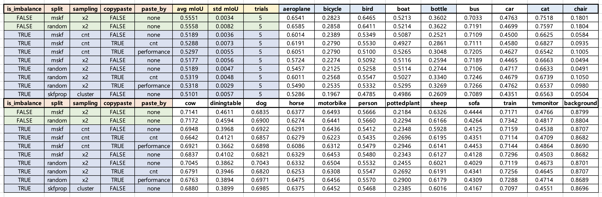

# Imbalance segmentation


## 1. Abstract
Class imbalance is very common problem in real world ML/DL problems, and also in semantic segmentation. This repo is an experiment to alleviate the class imbalance problem by using different train-val spitting, data sampling, and data augmentation.

&nbsp;

## 2. Dataset
VOC2012 dataset were used for the experiment and made `bird`, `cat`, `aeroplane`, `bicycle`, `bottle`, `chair` classes imbalanced intentionally. Only 1/5 of images are used for imbalance classes. ([code](https://github.com/NamSahng/imbalance_segmentation/blob/main/src/make_meta.py#L225)) I used VOC 2012 train dataset for train/valid dataset and VOC 2012 validation dataset as my test dataset.

&nbsp;

## 3. Methods
### 3-1. Train-Validation Split
- a. Random Sampling
- b. Multi-label Stratified K-Fold ([repo](https://github.com/trent-b/iterative-stratification))
    - Since there are more than one class on a image, stratified K-fold does not work. Also, multi-label stratified might be better than random sampling.
- c. Stratified K-Fold on images proportion clustered by K-means ([notebook](https://github.com/NamSahng/imbalance_segmentation/blob/main/src/exercise_notebooks/cluster_by_proportion.ipynb))
    - Not appropriate dataset like this. However, when a dataset which the proportion of its image(maybe biological data) is important I thought this approach might help. Small proportion classes such as bottle


### 3-2. Data Sampling
- Inspired by imbalanced-dataset-sampler([repo](https://github.com/ufoym/imbalanced-dataset-sampler)), I have concatenated full train dataset with imbalanced sampled dataset and treated as one epoch.
- Imblalanced sampled dataset's sampling strategy ([code](https://github.com/NamSahng/imbalance_segmentation/blob/main/src/train_nni.py#L174), [notebook](https://github.com/NamSahng/imbalance_segmentation/blob/main/src/exercise_notebooks/check_sampling_strategy.ipynb))
    - sampling by inverse log frequency of label
    - sampling by inverse log frequency of K-means group


### 3-3. Data Augmentation
- Copy-Paste augmentation ([paper](https://arxiv.org/pdf/2012.07177v1.pdf)) were used to relieve imbalance problem. Applied augmentation by referring to this ([code](https://github.com/hoya012/semantic-segmentation-tutorial-pytorch/blob/master/learning/utils.py#L246)), and the problem of seeing the object on the opposite border was fixed when an object being pasted was on the border of an image. (example - [notebook](https://github.com/NamSahng/imbalance_segmentation/blob/main/src/exercise_notebooks/check_augmentation.ipynb), code - [code](https://github.com/NamSahng/imbalance_segmentation/blob/9eca57f56c2dfc92bfdbea0dc96805cbadde0725/src/utils/augmentation.py#L128))
- Choosing source classes 
    - Less frequent classes
        - Paste classes that less than 60 objects in train dataset. And make less frequent classes to be more likely to be source class.
    - Bad performance 
        - Choose classes that are poorly performed in previous studies ([image](https://www.researchgate.net/figure/Evaluation-results-of-the-PASCAL-VOC-2012-test-set_tbl1_315635038))

&nbsp;

## 4. Experiment Details
- Segmentation model: DeepLabV3+ ([repo](https://github.com/qubvel/segmentation_models.pytorch))
- Encoder: ResNet 101
- Loss : Focal Loss ([repo](https://github.com/BloodAxe/pytorch-toolbelt/blob/develop/pytorch_toolbelt/losses/focal.py))
- Training management: NNI ([repo](https://github.com/microsoft/nni))
- GPU: RTX 3060

- Overfitting happened due to the small validation set (which is only 1/5 of VOC2012 train dataset). Therefore in my test dataset (VOC 2012 validation) performance is not as good as other pytorch DeepLabv3+ implementation such as [repo](https://github.com/VainF/DeepLabV3Plus-Pytorch) even though I tried to follow many training strategies above. 
- Main differences are learning rate(Encoder, Decoder), batch size, and early stopping and DeepLabV3+ model.

- I did minimum HPO on learning rate, encoder learning rate, and loss functions.

&nbsp;
## 5. Results

- Sampling strategy on dataset B (dataset A is original training samples)
    - Sampling based on only frequency of classes seems to hurt performance.
    - Correlation coefficient on (number of classes pixel & performance) and (proportion of classes & performance) was higher than frequency of classes.
        - correlation analysis on previus results ([notebook](https://github.com/NamSahng/imbalance_segmentation/blob/main/src/exercise_notebooks/correlation_on_results_data.ipynb))
        - correlation analysis my experiment ([notebook](https://github.com/NamSahng/imbalance_segmentation/blob/main/src/exercise_notebooks/check_result_2.ipynb))
    - Resampling based on pixel or proportion might help class imbalance problem.

- Splitting train & validation strategy
    - Multi-label stratified k-fold(mskf) is also counting on frequency of classes. Changing mskf to focus on pixel or proportion might help.

- Copy and Paste Augmentation
    - Pasting less frequennt labels 
        - Average performance gained on imbalanced labels: + 0.04241
        - with preserving other classes: + 0.00130
    - Pasting low performance labels
        - Average performance gained on low perfromance labels: + 0.03003
        - with preserving other classes: + 0.00238
    - details & wilcoxon rank sum test on mIoU differences:
        - [notebook](https://github.com/NamSahng/imbalance_segmentation/blob/main/src/exercise_notebooks/check_result_2.ipynb)

- Full Results


&nbsp;


## 6. How to run

### Prerequisites
- download VOC2012 dataset
```bash
$ wget http://host.robots.ox.ac.uk/pascal/VOC/voc2012/VOCtrainval_11-May-2012.tar
$ mkdir data
$ tar -xvzf VOCtrainval_11-May-2012.tar -C ./data
```
 - make conda environment
```bash
$ make env                  # create anaconda environment
$ conda activate <new_env>  # activate anaconda environment
$ make setup                # initial setup for the project
```

### Preprocess & Train 
- more about nni commands https://nni.readthedocs.io/en/v2.0/Tutorial/Nnictl.html
```bash
$ python src/make_meta.py  # preprocessing
$ nnictl create --config nni_config.yml # train with nni
```
&nbsp;

## 7. References
- https://github.com/trent-b/iterative-stratification
- https://github.com/microsoft/nni
- https://github.com/qubvel/segmentation_models.pytorch
- https://github.com/BloodAxe/pytorch-toolbelt
- https://github.com/VainF/DeepLabV3Plus-Pytorch

&nbsp;
## 8. More resources with imbalanced data
- https://github.com/ZhiningLiu1998/awesome-imbalanced-learning
- https://arxiv.org/pdf/1901.08394.pdf
- https://arxiv.org/pdf/2106.09643.pdf
- https://journalofbigdata.springeropen.com/track/pdf/10.1186/s40537-019-0192-5.pdf
- https://github.com/mlyg/unified-focal-loss
- https://arxiv.org/abs/2205.08209
